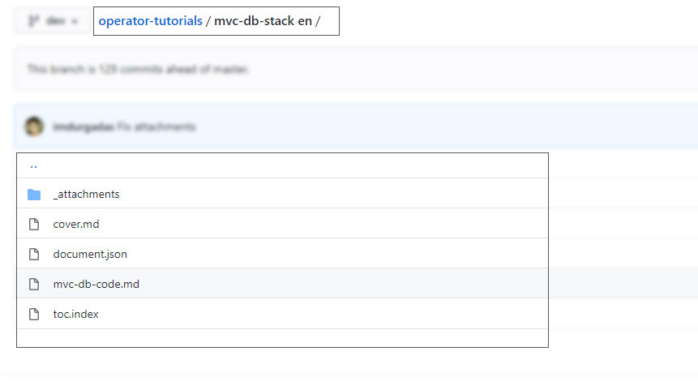
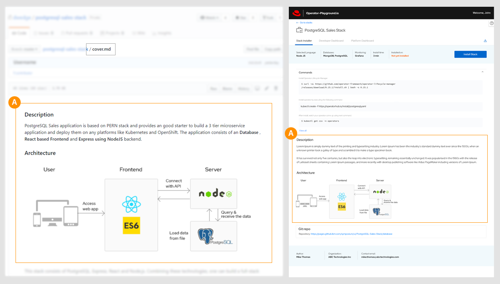
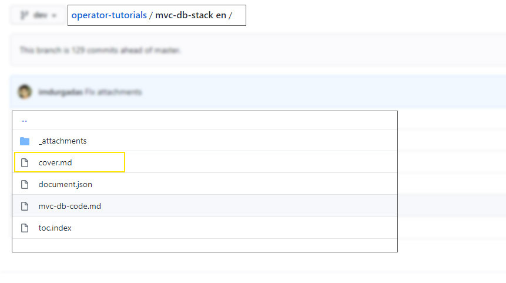
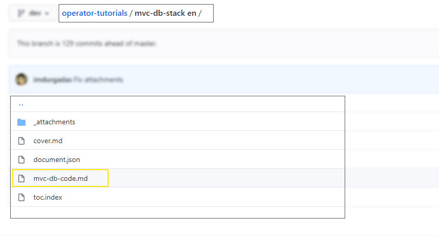

### Contribute a Stack

We encourage the developer community to contribute to :

- Stacks
- Datasets

Following are the steps that will help to do the same.

1. **Clone/Fork github repository : https://github.com/operator-playground/operator-tutorials.git**

2. Each Stack/Dataset requires a folder to be created with the naming convention:

   - Stack:  `<stack-name>-stack en `
   - Dataset: `<dataset-name>-dataset en `

3. The folder structure is defined as below:

   

   1. **document.json**

      This json file defines all the information specific to the stack/dataset:

      a. meta - Describes the stack specifications.

      b. commands - Defines the commands that needs to be executed to deploy the stack/dataset.

      c. cover - The name of the cover file for the stack/dataset. Refer below for more details on cover.

      c. content - Userguide/Tutorials for the stack.

   2. **cover.md**

      This page would be rendered on the stack builder dashboard and it would contain a brief description of a stack/dataset along with the  relevant information like architecture diagram, Dataset Schema etc as shown below.

      
      

   3. Tutorials - Developers user guide that provides information on:

      - How to use the stack.

      - Understand the stack composition/architecture.

      - How to deploy the stack, if user wishes to deploy manually.

      - How to access the deployed stack.

      

   Users can contribute more than 1 .md file as part of the user guide content.  

   **NOTE:** The userguide follows a flat file structure (all the files should be in the root of the stack folder) and cannot be in a nested structure.

