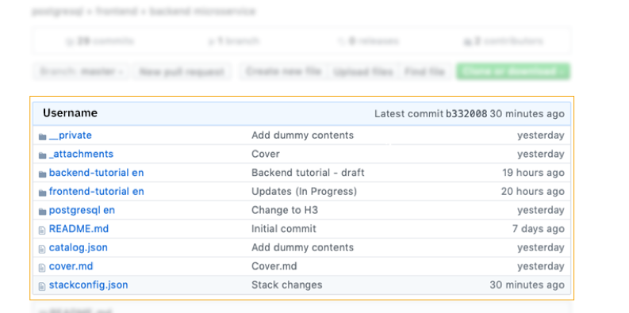
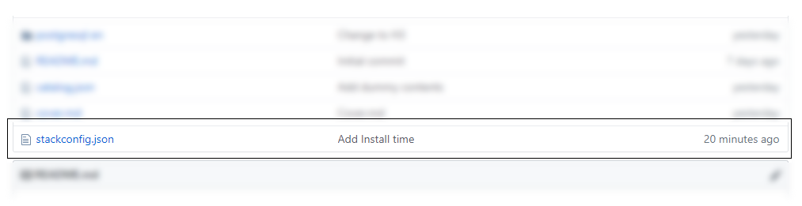
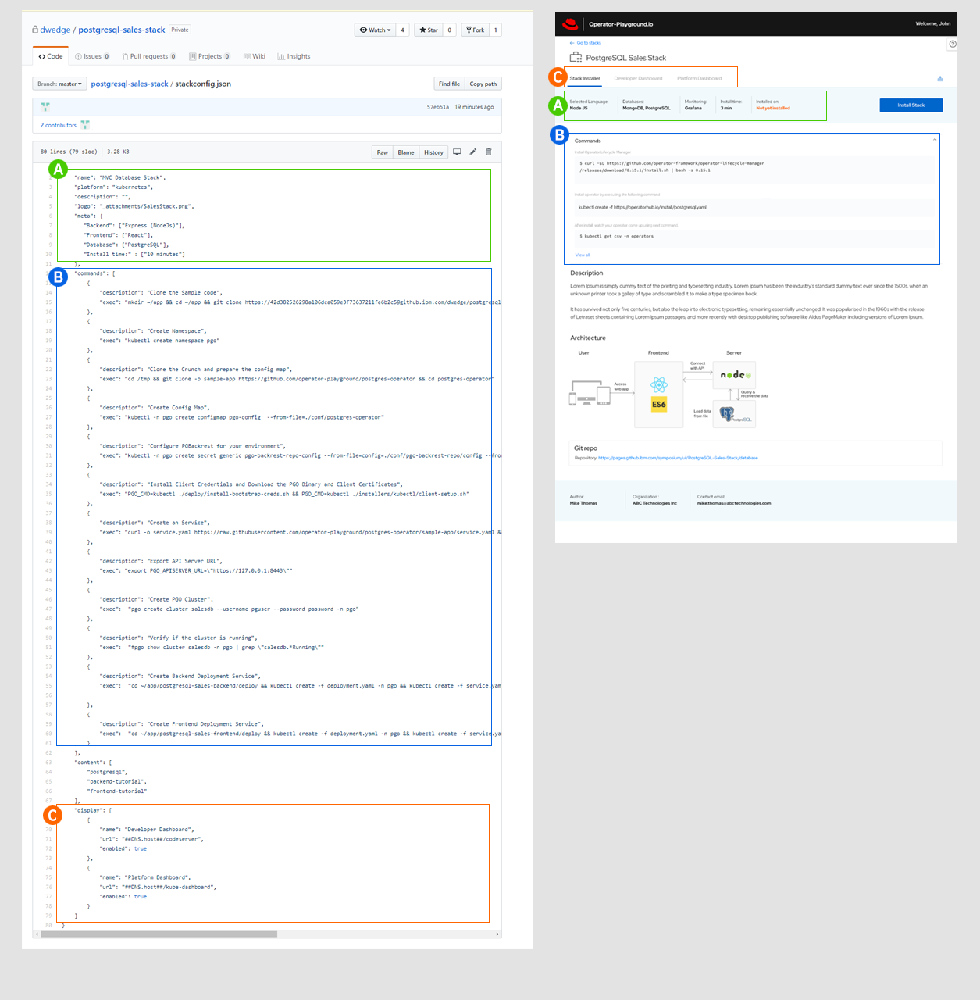
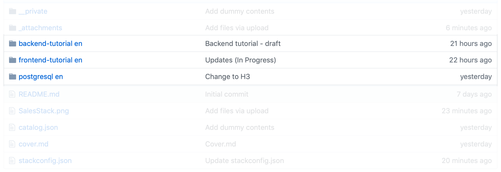

### Contribute a Stack

We encourage the developer community to contribute to the stack. 
Following are the steps that will help to do the same.

1. **Create github repository with the following structure.**

   The github structure defines:

   a. Tutorials

   b. Architecture/Overview

   c. Configurations

   

2. **stackconfig.json**

   This json file defines all the information specific to the stack:

   a. Commands - Defines the descriptions and the commands that needs to be executed to deploy the stack.

   b. Tutorials - Developers user guide that provides information on:

      - How to use the stack.
      
      - Understand the stack composition/architecture.
  
      - How to deploy the stack, if user wishes to deploy manually.
 
      - How to access the deployed stack.
   
      

      

3. **cover.md**
   
   This page would be rendered on the stack builder dashboard and it would contain a brief description of a stack along with the  architecture diagram as shown.
   
   
   

4. **Tutorial Files**

    Tutorials - Developers user guide that provides information on:
    
    a. How to use the stack.
   
    b. Understand the stack composition/architecture.
  
    c. How to deploy the stack, if user wishes to deploy manually.
 
    d. How to access the deployed stack.

    

